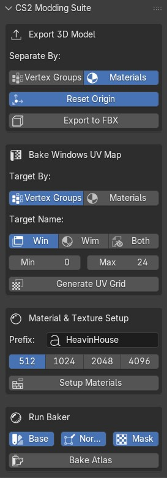
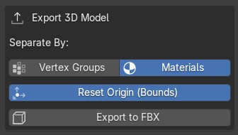
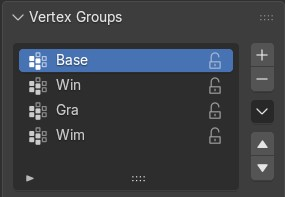
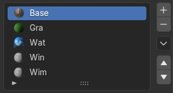
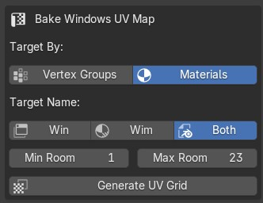
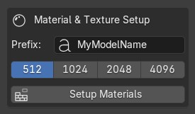
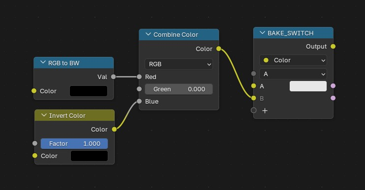
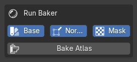

# 🏙️ CS2 Modding Suite for Blender

A complete, all-in-one Blender add-on designed to heavily automate the asset pipeline for **Cities: Skylines II**.

Gone are the days of manual exports, tedious UV adjustments for windows, and repetitive material baking. This suite provides a unified HUD in the 3D Viewport to handle mesh separation, procedural Windows UV mapping, Automated Material Setup, and Batch Baking for Atlas textures.

    

## 🛠️ Key Features

* **Smart FBX Exporter:** Duplicates your mesh, centers the origin, scales it perfectly for CS2, and automatically separates it into multiple `.fbx` files. You can now choose to separate the mesh by **Vertex Groups** OR by **Material Slots**.
* **Procedural Windows UV Grid:** Automatically maps the UVs of your windows to a 5x5 grid based on the CS2 day/night cycle logic. You control the brightness range!
* **Automated Material Setup & Batch Baking:** A seamless solution to generate atlas textures. The script automatically creates the required empty images, builds the complex `BAKE_SWITCH` node tree for every material, and 1-click bakes your `_BaseColor`, `_Normal`, and `_MaskMap`.

## 📦 Requirements

* **Blender 4.1** or higher (relies on the new Menu Switch node logic).
* Vertex Groups or Material names must follow the [Official CS2 Modding Conventions](https://cs2.paradoxwikis.com/Asset_Pipeline:_Buildings) (e.g., `Win`, `Wim`, `Gls`, `Gra`, `Wat`).

---

## 🚀 Installation

1. Download the script (`.py` file) or clone the repository.
2. Open Blender and go to **Edit > Preferences > Add-ons**.
3. Click **Install...** and select the downloaded Python file.
4. Check the box to enable **CS2 Modding Suite**.
5. Press `N` in the 3D Viewport to open the Sidebar. You will find a new tab called **CS2 Suite**.

---

## 📖 How To Use The Addon

### Module 1: Export 3D Model (FBX)

    

Even though the Cities: Skylines II editor is improving and asset importing will get easier, this automatic FBX exporting script remains incredibly useful for Blender artists.

This module prepares and exports your building modularly, exactly how the CS2 engine expects it. Originally written to work exclusively with Vertex Groups, the script can now also read and select faces based on their assigned materials. This provides a better visual representation of the in-game model and a smarter, more streamlined workflow.

⚠️ **KEEP IN MIND:** You must add at least one Vertex Group or Material named `Base`. This represents the main building mesh, excluding any submeshes.

Once your 3D model is prepared with the appropriate Vertex Groups or Materials, follow these steps to export:

1. **Select your main object** in Object Mode.
2. Choose your **Separate By** method:
<table>
  <tr>
    <td width="30%" align="center">
      
    </td>
    <td width="70%">
      <b>Vertex Groups (Legacy Method):</b> Ideal if you use a single material but have assigned polygons to groups like <code>Base</code>, <code>Gls</code>, <code>Win</code>. This is the original approach, kept in the suite to give 3D artists maximum freedom and flexibility in managing their models.
    </td>
  </tr>
  <tr>
    <td width="30%" align="center">
      
    </td>
    <td width="70%">
      <b>Materials (New & Recommended Method):</b> Ideal if you prefer assigning different materials (named <code>Base</code>, <code>Gls</code>, etc.) directly to the faces. Not only does this make the model visually more intuitive and easier to navigate in the viewport, but it also <b>prevents geometry overlaps</b>. While a single face can accidentally belong to multiple Vertex Groups, it can only have <em>one</em> material assigned to it, guaranteeing perfectly clean and unique separations!
    </td>
  </tr>
</table>

3. *(Optional)* Check **Reset Origin (Bounds)** if you want the script to automatically snap the pivot point to the absolute bottom-center of the mesh.
4. Click **Export to FBX**. The separated `.fbx` files will be automatically generated in a new folder located right next to your saved `.blend` file.

    <image src="images/export_result.jpg">

---

### Module 2: Bake Windows UV Map

    

Cities: Skylines II uses a specific 5x5 UV grid for windows to determine when lights turn on at night.

    <image src="images/Assetcreation_Window_Illumination_Room_Map_Reference.png" style="height: 400px" alt="Cities Skylines 2 Windows UV Map Reference">

1. Ensure the glass faces of your windows are assigned to a Vertex Group or a Material named exactly **`Win`** and/or **`Wim`** (for blurred glass windows).
2. Select your object in Object Mode.
3. In the CS2 Suite panel, set your desired light range:
    * **Min Room (Brightest):** `0` means the lights are almost always on.
    * **Max Room (Darkest):** `24` means the lights rarely turn on.
4. Click **Generate UV Grid**. The script will automatically unwrap, scale, and randomize the UV islands of your windows across the CS2 light grid.

---

### Module 3: Material & Texture Setup

    

Baking multiple materials into a single Atlas is extremely useful if you're creating a pack of different assets that share similar textures. 
To create it easily, just add a **Plane** to the scene and subdivide it to form a grid (2x2, 4x4, 8x8, etc.). Assign your different materials to the faces of this plane.

Here's an example of a simple 2x2 plane for our atlas:

    <image src="images/atlas_plane.jpg" style="height: 250px" alt="Atlas Plane">

**The Magic of Auto-Setup:**
In the past, you had to manually create empty textures and wire complex nodes (`RGB to BW` for Metallic, `Invert Color` for Roughness to Glossiness, and a custom Switch node) for *every single material*. **Now, the add-on does it all for you in one click!**

1. Select your Atlas Plane in Object Mode.
2. Type a **Prefix** for your textures (e.g., `MyAtlas`).
3. Select the desired **Resolution** (e.g., 2048). Smaller textures hold less detail but have a lower GPU impact.
4. Click **Setup Materials**.

**What happens behind the scenes?**
* The script generates three empty textures in memory (`Prefix_BaseColor`, `Prefix_Normal`, `Prefix_MaskMap`) with the correct color spaces.
* It injects Image Texture nodes at the top of your Shader Editor.
* It automatically builds the CS2 `BAKE_SWITCH` logic inside *all* the materials applied to your object, wiring Metallic and Roughness maps perfectly for the MaskMap generation.

 *(The node tree generated automatically by the script)*

---

### Module 4: Run Baker

    

Once your materials are set up (via Module 3), you are ready to bake!

1. Select the Atlas Plane you want to bake.
2. Check the boxes for the specific maps you want to generate (`Base`, `Normal`, `Mask`). *This is especially useful for saving time if you only need to fix and rebake a single map later!*
3. Click **Bake Atlas**. 
4. Sit back! The script will:
   * Force all materials to State A (BaseColor).
   * Configure Cycles for pure Diffuse baking (disabling lights/shadows) and bake the Color.
   * Switch to Normal baking.
   * Swap the materials to State B (MaskMap) and bake the Mask.
   * **Channel Packing:** Note that the Blue channel is not used by CS2; the script automatically transfers its data into the Alpha channel (used for glossiness).
   * Safely reset your materials to their original state.
5. ⚠️ **CRITICAL:** *Don't forget to save your generated images (`Alt + S`) in the Blender Image Editor before closing the program!*